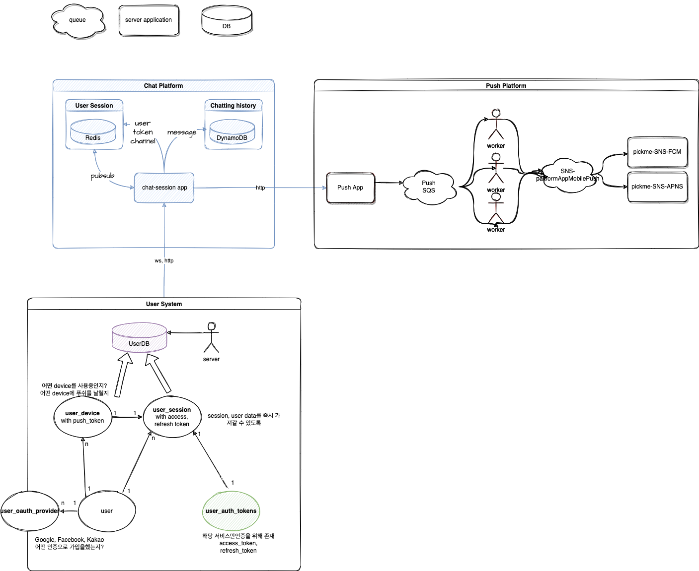

# Chat Platform
```
service --> http --> user, token, channel, message history
service --> ws --> pub/sub --> http --> push
```


## OpenAPI Docs
아래의 경로를 통해 API 명세 확인 가능
```
path : /docs
       /redoc
```


### User
* upsert를 통해 유저 정보를 등록/수정
  * 모든 유저 정보는 service 정보와 같이 등록
* delete를 통해 유저 정보를 삭제

### Token
* 푸시 토큰을 등록, 전체 삭제, 삭제
* 등록된 푸시 토큰을 통해 notification 전송

### Channel
* 멤버 정보 입력을 통해 채널 생성
* 특정 유저의 채널 리스트 확인
* 특정 채널 떠나기

### Message
* 특정 채널의 메세지 리스트 확인

### WebSocket
> 현재 openapi에서는 http만 지원해주고 있기 때문에 fake로 작성
* 웹소켓 연결 후 `/channels/_message`에 적혀진 포맷으로 메세지 전송


## Getting Started

### Set environment
1. `.env` 생성
```
cp .env.sample .env 
```

2. 설정
* `.env`파일에 환경변수 입력

3. 실행
```
docker-compose up
docker-compose up -d (background)
```
