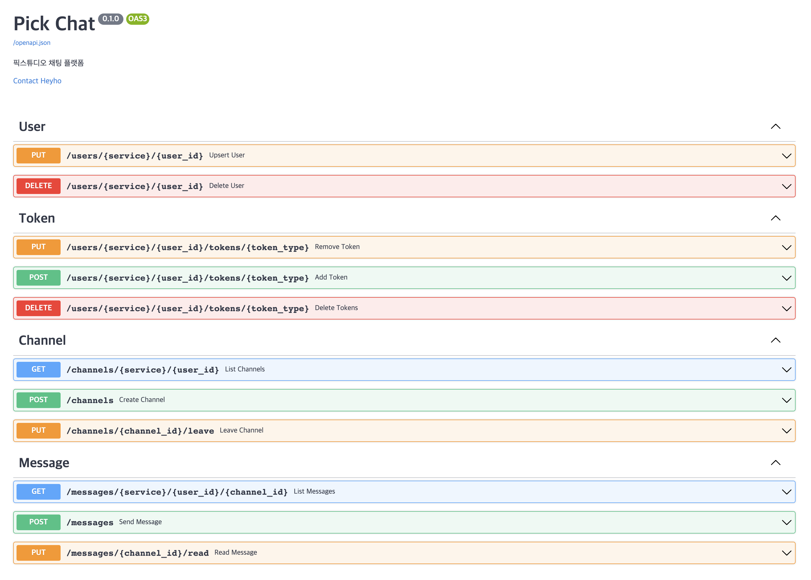

# Chat Platform
```
client <--ws-—> message —> [celery] —> dynamodb
               ㄴ <—> redis (pub/sub)
client --http-—> api —> redis (session storage)
```


## OpenAPI Docs
아래의 경로를 통해 API 명세 확인 가능
```
path : /docs
       /redoc
```


### User
* upsert를 통해 유저 정보를 등록/수정
  * 모든 유저 정보는 service 정보와 같이 등록
* delete를 통해 유저 정보를 삭제

### Token
* 푸시 토큰을 등록, 전체 삭제, 삭제
* 등록된 푸시 토큰을 통해 notification 전송

### Channel
* 멤버 정보 입력을 통해 채널 생성
* 채널 리스트 조회
* 채널 떠나기

### Message
* 메세지 리스트 조회
* 메세지 전송
* 메세지 읽음 처리


## Stack
* Python 3.9
* FastAPI 0.78
* Redis
* AWS DynamoDB


## Getting Started

### Set environment
1. `.env` 생성
```
cp .env.sample .env 
```

2. 입력
* `.env` 파일에 환경변수 입력

3. 실행
```
docker-compose up
docker-compose up -d (background)
```
